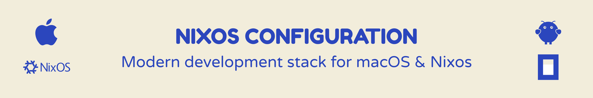

# Nix Environments for macOS + Linux VPS (Snowfall Lib)

This repository manages two machines with one flake:

- `macbook` on `aarch64-darwin` (nix-darwin)
- `aurora` on `x86_64-linux` (NixOS)

Snowfall Lib auto-discovers systems, homes, and modules under `src/`.

## Layout

```text
src/
├── homes/
│   ├── aarch64-darwin/
│   │   └── adampaterson@macbook/default.nix
│   └── x86_64-linux/
│       └── adam@aurora/default.nix
├── modules/
│   ├── base.nix
│   ├── darwin/
│   │   ├── base/default.nix
│   │   └── system/
│   │       ├── default.nix
│   │       └── input/default.nix
│   ├── home/
│   │   └── common/
│   │       ├── default.nix
│   │       ├── git/default.nix
│   │       ├── opencode/default.nix
│   │       ├── packages/default.nix
│   │       ├── shell/default.nix
│   │       ├── spaceship/default.nix
│   │       └── ssh-agent-1password/default.nix
│   └── nixos/
│       ├── base/default.nix
│       └── server/default.nix
└── systems/
    ├── aarch64-darwin/
    │   └── macbook/default.nix
    └── x86_64-linux/
        └── aurora/
            ├── default.nix
            └── hardware-configuration.nix
```

## How Modules Are Applied

- `src/modules/home/*` modules apply to all Home Manager profiles.
- `src/modules/darwin/*` modules apply to all darwin systems.
- `src/modules/nixos/*` modules apply to all NixOS systems.

This keeps host files small and host-specific, while shared behavior lives in `modules/`.

## 1Password SSH Agent

SSH keys stay in 1Password. Nix only points SSH to the 1Password agent socket.

- macOS default socket: `~/Library/Group Containers/2BUA8C4S2C.com.1password/t/agent.sock`
- Linux default socket: `~/.1password/agent.sock`

Enable per-home with:

```nix
local.onePasswordSSH.enable = true;
```

## Spaceship Prompt

`src/modules/home/common/spaceship/default.nix` configures Spaceship for Zsh and is enabled by default.

Optional per-home overrides:

```nix
local.prompts.spaceship = {
  enable = true;
  addNewline = false;
  separateLine = false;
};
```

## OpenCode

`src/modules/home/common/opencode/default.nix` manages OpenCode CLI on both hosts and can manage `~/.config/opencode/opencode.json`.

Per-home options:

```nix
local.opencode = {
  enable = true;
  manageConfig = true;
  settings = { ... };      # rendered to JSON
  settingsFile = null;     # optional path to existing JSON file
  installDesktop = false;  # macOS desktop package
};
```

Note: at the currently pinned upstream revision, OpenCode desktop package eval is broken on `aarch64-darwin`; the module falls back to CLI-only and emits a warning when `installDesktop = true`.

## OpenClaw

`src/modules/home/common/openclaw/default.nix` wraps `openclaw/nix-openclaw` for both hosts and follows the same config pattern as OpenCode:

```nix
local.openclaw = {
  enable = true;
  manageConfig = true;
  settings = { ... };      # used when settingsFile = null
  settingsFile = ../../../config/openclaw/shared.json;  # JSON source of truth
  installApp = true;       # macOS only
};
```

Behavior:

- `settingsFile` takes precedence over `settings`.
- JSON is parsed and applied to `programs.openclaw.config`.
- Shared baseline lives at `src/config/openclaw/shared.json`.

Export live config back to JSON for committing:

```bash
openclaw-export-config
# or explicit target:
openclaw-export-config /path/to/shared.json
```

## Cloudflared (aurora)

`src/modules/nixos/cloudflared/default.nix` adds a host-level wrapper around `services.cloudflared`.

Aurora wiring lives in:

- `src/systems/x86_64-linux/aurora/default.nix`

Example enablement:

```nix
local.cloudflared = {
  enable = true;
  tunnelId = "<tunnel-uuid>";
  credentialsFile = "/var/lib/cloudflared/<tunnel-uuid>.json";
  ingress = {
    "app.example.com" = "http://127.0.0.1:3000";
  };
  defaultService = "http_status:404";
};
```

Notes:

- Keep credentials JSON out of git.
- Place credentials on host (for example `/var/lib/cloudflared/<tunnel-uuid>.json`) with root-readable permissions.

## Commands

### Inspect outputs

```bash
nix flake show
```

### Developer Workflow

```bash
# List available tasks
just --list

# Auto-format + auto-fix lints
just fix

# Full local CI pass
just ci
```

### Direnv + nixd (VS Code)

This repo provides a flake dev shell named `dev` with `nixd` and common Nix tooling.

```bash
# one-time
direnv allow

# manual shell entry (optional)
nix develop .#dev
```

The `.envrc` is configured to load `.#dev`, so entering the repo adds `nixd` to your environment.

### macOS (build + switch)

```bash
nix build .#darwinConfigurations.macbook.system
nix run nix-darwin -- switch --flake .#macbook
```

### Linux VPS (build + switch)

```bash
nix build .#nixosConfigurations.aurora.config.system.build.toplevel
sudo nixos-rebuild switch --flake .#aurora
```

### Home Manager

```bash
home-manager switch --flake .#adampaterson@macbook
home-manager switch --flake .#adam@aurora
```

## Automation

- GitHub Actions checks are defined in `.github/workflows/nix-checks.yml`.
- GitHub Actions cache population is defined in `.github/workflows/nix-cache.yml`.
- GitHub Actions deploy via Cachix agents is defined in `.github/workflows/cachix-deploy-agents.yml`.
- Reusable cache job logic lives in `.github/workflows/_nix-build-and-push-cache.yml`.
- Pre-commit hooks are managed by devenv in `src/shells/default/default.nix`.

### CI and Cache Flow

`nix-checks.yml` runs on:

- pull requests
- pushes to `main`

`nix-cache.yml` runs on:

- successful completion of `nix-checks.yml` on `main`
- `workflow_dispatch` (manual)

It builds and pushes these cache targets:

- Linux: `devShells.x86_64-linux.default`, `nixosConfigurations.aurora.config.system.build.toplevel`
- macOS: `devShells.aarch64-darwin.default`, `darwinConfigurations.macbook.system`, `homeConfigurations."adampaterson@macbook".activationPackage`

Required repository configuration for cache push and deploy:

- variable or secret `CACHIX_CACHE_NAME`
- secret `CACHIX_AUTH_TOKEN`
- secret `CACHIX_ACTIVATE_TOKEN` (for `cachix deploy activate`)

Use `cachix-deploy-agents.yml` for agent activation after cache builds.
The workflow dispatch inputs let you deploy only Aurora, only macbook, or both.

### Local Cache Target Commands

```bash
# Linux cache targets (same attrs as CI cache workflow)
just cache-targets-linux

# macOS cache targets (same attrs as CI cache workflow)
just cache-targets-macos
```

### Devenv Notes

- `devenv.root` is pinned in `src/shells/default/default.nix` so `nix flake show` works reliably in CI.
- `cachix.pull = [ "adam-paterson" ]` is enabled in the dev shell for fast local substitute downloads.

### Cachix Agent Bootstrap

Run this once per host after creating the agent/token in Cachix Deploy:

```bash
# Aurora (NixOS)
sudo CACHIX_AGENT_TOKEN="<token>" cachix deploy agent aurora system --bootstrap

# macbook (nix-darwin)
sudo CACHIX_AGENT_TOKEN="<token>" cachix deploy agent macbook system-profiles/system --bootstrap
```

Pre-commit hooks are installed automatically when entering the devenv shell.

## Important Notes

- Snowfall only discovers files tracked by git.
- System identifier `macbook` does not change your real macOS hostname; that remains set in `systems/aarch64-darwin/macbook/default.nix`.
- Replace `REPLACE_ME` SSH public key in `src/systems/x86_64-linux/aurora/default.nix`.
- Replace `src/systems/x86_64-linux/aurora/hardware-configuration.nix` with values generated on the server.
- For a truly headless VPS, 1Password agent requires an active desktop/session; otherwise use SSH agent forwarding from your laptop.
